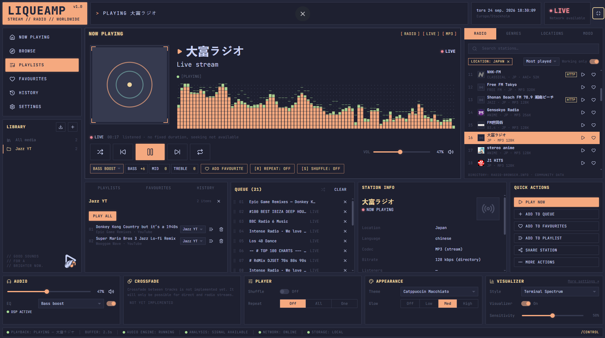
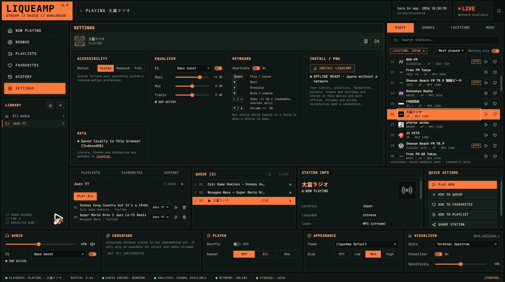

# LIQUEAMP

### *It really Liques the Llamas Ass!*

**A weirdly over-engineered music player for music, radio and everything in between.**

[**▶ LIVE DEMO**](https://thermoptic.github.io/LiqueAmp/)

---

## 🎵 What is LiqueAmp?

**LiqueAmp** is a browser-based music player and internet radio application designed to feel more like a piece of software than a website.
It combines a **music player, radio browser, library, playlists and audio visualizer** into one terminal-inspired interface.
The design mixes **retro software, radio equipment and futuristic control panels** with dark colours, glowing orange accents, monospaced typography and an unhealthy amount of tiny status indicators.
Basically: **Winamp went to a radio station, got bitten by a cyberpunk llama, and came back as a web app.**

---

## 📸 Screenshots

### Now Playing

### Settings

---

## ✨ Features

- 🎵 **Music player** — playback, volume, shuffle, repeat & queue
- 📻 **Internet radio** — browse stations by location, genre & popularity
- 📚 **Local library** — store and organize your music
- 📋 **Playlists** — create, edit and play playlists
- ❤️ **Favourites** — save tracks and stations
- 🕘 **History** — keep track of what you've played
- 📊 **Audio visualizer** — real-time spectrum visualization
- 🎚️ **Equalizer** — bass, mid, treble & DSP controls
- 🎨 **Theming** — customizable colours, glow and appearance
- 🌈 **Base16 support** — use existing Base16 colour schemes
- 💾 **Offline-first** — local data stored in the browser
- 📱 **PWA** — designed for desktop and mobile
- ⌨️ **Keyboard controls** — control playback without touching the mouse
- 🛠️ **Control Panel** — manage streams, content, themes and settings
- 📱 **Responsive UI** — desktop control room, mobile music player

---

## 🧠 The idea

LiqueAmp is built around three things:

**Music should be fun.  
Interfaces should have personality.  
And absolutely nobody needs another boring Spotify clone.**

---

### 🦙 LIQUEAMP

**STREAM // RADIO // WORLDWIDE**

*Made with questionable amounts of enthusiasm.*

